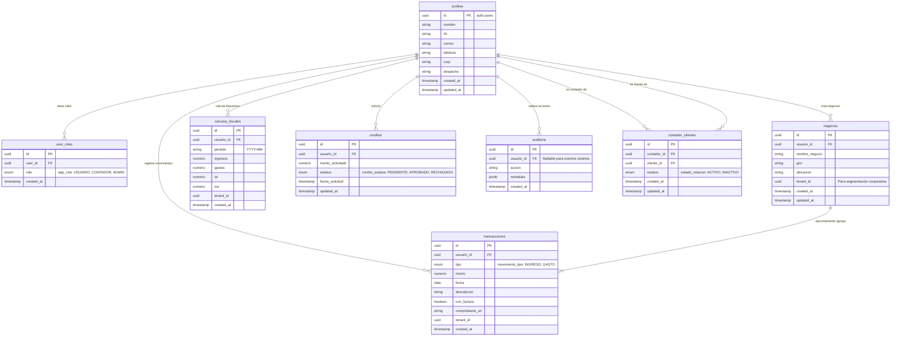

# Diagrama Entidad-Relación (ER) — Facilito

El siguiente diagrama ilustra la arquitectura de la base de datos PostgreSQL de la plataforma, diseñada bajo el modelo multi-tenant.

## Notas Técnicas
1. **Multi-tenant:** Las tablas transaccionales cuentan con `tenant_id` para aislar datos a futuro si el software se despliega en esquemas B2B pesados.
2. **RLS (Row Level Security):** Todas las relaciones están protegidas a nivel de base de datos en Supabase. Un usuario solo puede acceder a las filas donde `usuario_id = auth.uid()` o si cuenta con el rol `ADMIN`.
3. **Auditoría:** La tabla `auditoria` no tiene foreign key estricta hacia `profiles` para permitir el registro de eventos de sistema o intentos de login fallidos donde el `auth.uid()` aún no existe.
