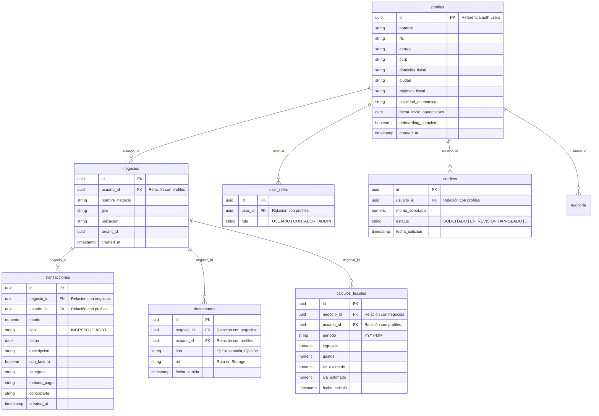

# Diagrama Entidad-Relación (ER) - RESICO

Este documento describe la estructura de datos de la plataforma, extraída de las migraciones de base de datos y definiciones de tipos de Supabase.

## Arquitectura de Datos (Mermaid)

## Resumen de Tablas Detectadas

| Tabla | Propósito | Relación Principal |
|-------|-----------|-------------------|
| `profiles` | Almacena el perfil fiscal y personal del usuario. | Extensión de `auth.users`. |
| `negocios` | Entidad central del comercio o actividad profesional. | Pertenece a un `profile`. |
| `transacciones` | Registro de flujos monetarios (Ingresos/Gastos). | Asociado a un `negocio`. |
| `documentos` | Repositorio de archivos PDF/JPG del expediente. | Vinculado a un `negocio`. |
| `calculos_fiscales` | Historial de proyecciones de impuestos. | Resultado de análisis sobre `negocios`. |
| `user_roles` | Gestión de permisos (RBAC). | Determina el acceso (Admin/Contador/Usuario). |
| `creditos` | Gestión de solicitudes de apoyo gubernamental. | Solicitado por un `usuario`. |

---
*Documentación generada automáticamente bajo el Protocolo de Documentación Automatizada v1.0.*
